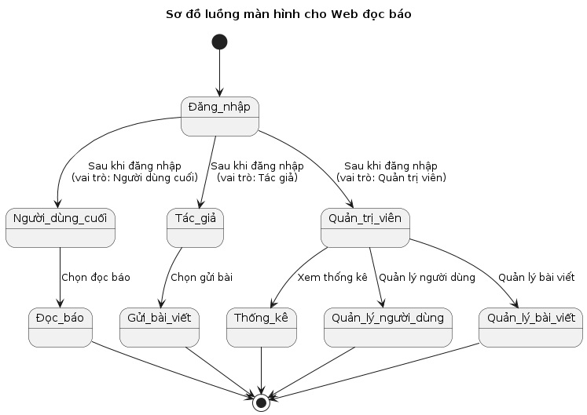

## 1. TỔNG QUAN ĐỀ TÀI
### 1.1 Kế Hoạch
Dưới đây là kế hoạch thực hiện đề tài xây dựng trang web đọc báo, áp dụng mô hình phát triển tăng trưởng (iterative development), cho phép cải tiến dần dần qua từng giai đoạn. Quy trình này được chia thành các giai đoạn chính với mốc thời gian cụ thể:

#### Giai đoạn 1: Phân tích Yêu cầu và Thiết kế Sơ bộ
**Thời gian**: 21/04 - 28/04
- **Phân tích yêu cầu**: Tìm hiểu những trang web đọc báo, phân tích để thu thập yêu cầu về tính năng và giao diện người dùng.
- **Thiết kế sơ bộ**: Tạo bản mẫu thiết kế sơ bộ cho trang web bao gồm wireframes và thiết kế cơ bản.

#### Giai đoạn 2: Phát triển Phiên bản Đầu tiên
**Thời gian**: 28/04 - 05/05
- **Xây dựng cơ bản**: Phát triển các tính năng cốt lõi như đăng nhập, xem bài viết.
- **Kiểm thử**: Thực hiện kiểm thử các chức năng

#### Giai đoạn 3: Phát triển và Mở rộng
**Thời gian**: 05/05 - 12/05
- **Phát triển tính năng**: Thêm tính năng tìm kiếm, lọc bài viết và cá nhân hóa nội dung.
- **Kiểm thử và tối ưu hóa**: Tiếp tục kiểm thử và cải tiến hiệu suất trang web.

#### Giai đoạn 4: Phát triển Tính năng Quản trị
**Thời gian**: 12/05 - 19/05
- **Quản lý nội dung và người dùng**: Phát triển giao diện quản lý cho admin để xét duyệt bài viết và quản lý người dùng.
- **Báo cáo và phân tích**: Tích hợp công cụ phân tích để theo dõi các chỉ số sử dụng trang web.

#### Giai đoạn 5: Tối ưu và Chuẩn bị Hoàn thành
**Thời gian**: 19/05 - 26/05
- **Kiểm thử cuối cùng**: Thực hiện kiểm thử toàn diện để đảm bảo mọi tính năng hoạt động trơn tru.

#### Giai đoạn 6: Phát triển và Cập nhật Liên tục
**Thời gian**: Tháng 5 trở đi
- **Phát triển liên tục**: Thêm các tính năng mới và cập nhật dựa trên yêu cầu thị trường và phản hồi người dùng.
- **Đánh giá và cải tiến**: Đánh giá hiệu quả sử dụng trang web, thực hiện cải tiến để đáp ứng nhu cầu ngày càng cao của người dùng.

### 1.2. Mô tả ý tưởng đề tài

Chúng tôi mong muốn xây dựng một website đọc báo bao gồm các tính năng chính sau:

 1. **Cập Nhật Tin Tức Thời Gian Thực:** Website cung cấp tin tức cập nhật liên tục từ nhiều nguồn uy tín và đa dạng, tự động phân loại tin tức theo chủ đề.

 1. **Giao Diện Thân Thiện:** Đảm bảo trải nghiệm người dùng mượt mà trên cả máy tính và điện thoại di động, với thiết kế responsive tương thích với mọi kích cỡ màn hình.

 1. **Tùy Chỉnh Người Dùng:** Người dùng có thể tùy chỉnh giao diện và loại tin tức họ muốn theo dõi, từ chính trị, kinh tế đến thể thao, giải trí.

 1. **Quản lý người dùng:** Có khả năng xem, thêm, xóa, hoặc cấm người dùng từ hệ thống.

 1. **Quản lý nội dung:** Xét duyệt và quản lý các bài đăng từ tác giả, chỉnh sửa nội dung nếu cần.

 1. **Báo cáo và Phân tích:** Truy cập vào bảng điều khiển để xem các số liệu thống kê như số lượng người dùng đăng ký mới, số lượt xem bài viết, tương tác người dùng, v.v.

 1. **Thống kê bài viết:** Xem số liệu về số lượt xem, bình luận, và chia sẻ của các bài viết mình đăng.

 1. **Phản hồi từ Admin:** Nhận xét, phản hồi từ admin về các bài viết để cải thiện chất lượng nội dung.

 1. **Hỗ trợ từ Admin:** Tác giả có thể yêu cầu sự hỗ trợ kỹ thuật hoặc chỉnh sửa nội dung từ admin để tối ưu hóa bài viết.

### 1.3. Sản phẩm MVP

1. Giao diện xem tin tức:
 - Hiển thị các bài viết theo danh mục như Thời sự, Kinh doanh, Công nghệ, v.v.
 - Bài viết được tổ chức theo độ mới và mức độ phổ biến.
 - Người dùng có thể nhấp vào mỗi tiêu đề để đọc toàn bộ bài viết.
2. Chức năng tìm kiếm:
 - Cung cấp khả năng tìm kiếm bài viết theo từ khóa.
 - Có thể lọc kết quả tìm kiếm theo ngày tháng hoặc danh mục.

### 1.4. Sản phẩm hoàn thiện

Dưới đây là chi tiết về sản phẩm hoàn thiện:

#### 1.4.1. Tính năng cho Người dùng (User)
- Hoàn thiện các chức năng cơ bản của web đọc báo như đăng ký/đăng nhập, đọc báo.

#### 1.4.2. Tính năng cho Tác giả (Author)
- Tác giả có thể theo dõi thống kê về số bài báo mà mình viết

#### 1.4.3. Tính năng cho Quản trị viên (Admin)
-  **Quản lý nội dung toàn diện**: Quản trị viên có quyền kiểm duyệt và chỉnh sửa bài viết và xóa nội dung không phù hợp.
- **Phân tích dữ liệu và báo cáo**: Truy cập vào các báo cáo chi tiết về lượt truy cập, tương tác người dùng, và hiệu suất bài viết để đưa ra quyết định chiến lược.

#### 1.4.4. Các tính năng bổ sung
- **Chức năng tóm tắt bài báo**: Giúp người đọc có thể đọc báo nhanh hơn mà không bị mất thông tin

## 2. PHÂN TÍCH

### 2.1 Giới thiệu

#### 2.1.1. Mục đích

Mục đích của đề tài này là phát triển một trang web đọc báo trực tuyến, nhằm mục tiêu cung cấp một nền tảng tin tức đáng tin cậy và dễ tiếp cận cho người dùng. Trang web sẽ hỗ trợ người dùng trong việc cập nhật thông tin nhanh chóng, theo dõi các sự kiện thời sự và các lĩnh vực khác nhau một cách hiệu quả. Dự án nhằm mục tiêu đáp ứng các yêu cầu chức năng, phi chức năng và các ràng buộc thiết kế như sau:

##### 2.1.1.1 Yêu Cầu Chức Năng
1. **Đăng nhập và Đăng ký**: Người dùng có thể đăng nhập hoặc đăng ký tài khoản mới. Hỗ trợ đăng nhập xã hội để tăng cường tính tiện lợi và tương tác.
2. **Đọc báo**: Người dùng có thể xem, tìm kiếm, đọc tóm tắt bài báo và lọc các bài viết theo chủ đề, mức độ phổ biến, và đọc bài báo bằng ngôn ngữ khác.
3. **Quản lý Tác Giả**: Các tác giả có thể tạo, chỉnh sửa và quản lý các bài viết của họ.
4. **Quản lý Quản Trị**: Admin có thể quản lý người dùng, bài viết, bình luận và các thiết lập trên trang web.

### Yêu Cầu Phi Chức Năng
1. **Hiệu Suất**: Trang web cần đạt được thời gian phản hồi nhanh, đặc biệt trong việc tải trang và cập nhật nội dung mới.
2. **Độ Tin Cậy**: Hệ thống cần phải ổn định và có khả năng phục hồi nhanh chóng sau sự cố.
3. **Bảo Mật**: Đảm bảo an toàn thông tin cá nhân của người dùng và dữ liệu bài viết thông qua các biện pháp mã hóa và xác thực.
4. **Khả Năng Mở Rộng**: Cơ sở hạ tầng của trang web cần được thiết kế để dễ dàng mở rộng, phục vụ số lượng lớn người dùng và dữ liệu.
5. **Tương Thích**: Hỗ trợ tất cả các trình duyệt web hiện đại và thiết bị di động để đạt được tính linh hoạt và tiếp cận rộng rãi.

### Ràng Buộc Về Mặt Thiết Kế
1. **Giao Diện Người Dùng**: Thiết kế phải thân thiện, dễ sử dụng, và đáp ứng (responsive design), đảm bảo trải nghiệm người dùng nhất quán trên các thiết bị khác nhau.
2. **Tiêu Chuẩn Web**: Tuân thủ các tiêu chuẩn web hiện hành như HTML5, CSS3, và JavaScript ES6 để đảm bảo tính tương thích và hiệu suất.
3. **Quy Định Pháp Lý**: Tuân thủ các quy định về bảo vệ dữ liệu cá nhân.
4. **Tích Hợp API**: Khả năng tích hợp với các dịch vụ bên ngoài để mở rộng chức năng và hiểu biết về người dùng.

Sản phẩm cuối cùng sẽ là một trang web đọc báo đáng tin cậy, đáp ứng tốt mọi yêu cầu và mong đợi của người dùng, tác giả, và quản trị viên, từ đó tạo ra một môi trường thông tin mở, hiện đại và tương tác.

#### 2.1.2 Phạm vi

Ứng dụng web đọc báo này được thiết kế để cung cấp nội dung tin tức cập nhật, từ thời sự chính trị đến các chủ đề giải trí, kinh tế, khoa học, và công nghệ. Giao diện người dùng được thiết kế để dễ dàng sử dụng, tối ưu cho máy tính, hỗ trợ đa ngôn ngữ để tiếp cận người dùng quốc tế.

**Đối Tượng Phục Vụ:**
- Người dùng chính là cá nhân đang tìm kiếm thông tin và tin tức cập nhật trên internet.
- Tác giả và nhà báo muốn xuất bản và quản lý các bài viết của mình.
- Quản trị viên web cần công cụ để quản lý nội dung, người dùng và bình luận.

**Nhóm Các Hệ Thống Con:**
- **Hệ Thống Quản Lý Người Dùng**: Xử lý đăng ký, đăng nhập, và quản lý hồ sơ người dùng.
- **Hệ Thống Quản Lý Nội Dung**: Các công cụ để tạo, chỉnh sửa, và phân phối nội dung.
- **Hệ Thống Phân Tích và Báo Cáo**: Dùng để thu thập và phân tích dữ liệu về hành vi người dùng và hiệu suất bài viết.

**Đối Tượng Sử Dụng Tài Liệu:**
Tài liệu này phục vụ cho nhà phát triển phần mềm, nhà thiết kế UX/UI, nhà quản lý dự án, nhà phân tích hệ thống, và bất kỳ ai liên quan đến việc phát triển và triển khai ứng dụng đọc báo này. Nó cung cấp một cái nhìn tổng quan về các yêu cầu, chức năng và mục tiêu của sản phẩm, giúp tất cả các bên liên quan hiểu rõ phạm vi và mục đích của dự án.

### 2.2 Phân tích yêu cầu

#### 2.2.1 Đặc tả Actors

##### Actor 1: Người dùng cuối (End User)
- **Mô tả**: Người dùng cuối là những cá nhân sử dụng trang web để đọc, tìm kiếm, và tương tác với nội dung báo. Họ có thể đăng ký, đăng nhập, bình luận và chia sẻ các bài viết.

##### Actor 2: Tác giả (Author)
- **Mô tả**: Tác giả là người tạo ra nội dung cho trang web. Họ có quyền đăng bài viết mới, chỉnh sửa bài viết của mình, và theo dõi thống kê về bài viết của họ.

##### Actor 3: Quản trị viên (Administrator)
- **Mô tả**: Quản trị viên là người có quyền cao nhất trên hệ thống. Họ quản lý người dùng, tác giả, nội dung của bài viết, cài đặt hệ thống, và có quyền truy cập vào các công cụ phân tích tổng thể.

#### 2.2.2 Đặc tả Use-cases

##### 1. Đăng nhập/Đăng kí
- **Mục đích:** Cho phép người dùng tạo tài khoản cá nhân hoặc đăng nhập vào hệ thống.
- **Đăng kí:** Người dùng nhập thông tin cá nhân (email, mật khẩu, tên,...) và gửi đến server để tạo tài khoản mới.
- **Đăng nhập:** Người dùng nhập thông tin xác thực (email/mật khẩu) để truy cập vào hệ thống và sử dụng các chức năng dành cho thành viên.

##### 2. Đọc báo
- **Mục đích:** Cho phép người dùng truy cập và đọc các bài báo.
- Người dùng chọn bài báo từ danh sách hoặc tìm kiếm và có thể đọc toàn bộ nội dung trên giao diện trực quan.

##### 3. Gửi bài báo
- **Mục đích:** Tác giả có thể gửi bài viết của mình lên hệ thống.
- Tác giả nhập nội dung bài viết, đính kèm hình ảnh (nếu có) và gửi bài viết để xét duyệt và xuất bản trên trang web.

##### 4. Sắp xếp theo danh mục
- **Mục đích:** Phân loại bài báo theo các danh mục khác nhau để dễ dàng tìm kiếm và truy cập.
- Người dùng có thể chọn xem các bài báo theo danh mục như Kinh tế, Thể thao, Giải trí,...

##### 5. Tóm tắt bài báo
- **Mục đích:** Cung cấp tóm tắt nội dung chính của bài báo cho người dùng, giúp họ nắm bắt thông tin nhanh chóng.
- Hệ thống sử dụng công nghệ AI để phân tích và tạo tóm tắt ngắn gọn từ nội dung bài viết đầy đủ.

##### 6. Quản lý bài báo
- **Mục đích:** Cho phép quản trị viên và biên tập viên quản lý nội dung các bài báo trên trang web.
- Bao gồm chức năng thêm, sửa, xoá bài viết và duyệt bài viết gửi lên từ các tác giả.

##### 7. Quản lý người dùng
- **Mục đích:** Quản lý thông tin người dùng, quyền truy cập và hoạt động của người dùng trên trang web.
- Quản trị viên có thể thêm, sửa, xóa tài khoản người dùng và cấp quyền truy cập cho các tài khoản phù hợp.

##### 8. Thống kê và báo cáo
- **Mục đích:** Cung cấp thông tin thống kê về lượng truy cập, số lượt đọc bài báo, số bài viết được đăng,...
- Hệ thống tạo báo cáo dựa trên dữ liệu thu thập được, giúp quản trị viên đánh giá hiệu suất và điều chỉnh chiến lược nội dung.

#### Liệt kê các use-cases theo actor:
- **Người dùng cuối (End User)**:
    - UC01: Đăng nhập
    - UC05: Bình luận và phản hồi

- **Tác giả (Author)**:
    - UC01: Đăng nhập
    - UC03: Đăng bài viết

- **Quản trị viên (Administrator)**:
    - UC01: Đăng nhập
    - UC02: Thống kê
    - UC04: Quản lý người dùng

## 3. THIẾT KẾ

### 3.1. Activity Diagram

### 3.2. ER Diagram

 

### 3.3. Database Diagram

### 3.4. Screen flow

## 4. HIỆN THỰC

### 4.1. Công nghệ sử dụng
Bootstrap , Django , API Gemini

### 4.2. Giao diện ứng dụng

### 4.3. Kết quả

- Làm được
 - Hoàn thành được những chức năng cơ bản
 - Giao Diện Đáp Ứng yêu cầu
 - Tích hợp công nghệ AI tóm tắt văn bản  
- Chưa làm được
 - Độ Tùy Biến Giao Diện Người Dùng
 - Thách Thức Về Quản Lý Nội Dung Khả Năng Mở Rộng
 - Chưa hỗ trợ đa ngôn ngữ
- Hướng phát triển
 - Thêm tùy biến giao diện do người dùng điều chỉnh
 - Thêm các công cụ quản lý nội dung tiên tiến
 - Hỗ trợ đa ngôn ngữ

## 5. GHI CHÚ CÁC CÔNG VIỆC

### 5.1 Phân công

| **Thành Viên**  | **Nhiệm Vụ**  | **Tiến độ hoàn thành**  |
|------------|------------|------------|
| Nguyễn Năng Anh  | Front-End , Back-End , Thuyết Trình  | 100%  |
| Cao Phan Khánh Duy  | Thiết Hệ thống , Viết báo cáo , PPT ,Thuyết Trình |100% |
| Nguyễn Văn Hiên  | Xây dựng DB , Vẽ sơ đồ ER-ERD , Viết báo cáo ,Thuyết trình |100%  |
| Bùi Thị Ngọc Trân  | Tester ,Viết báo cáo , Thuyết Trình | 100%  |

### 5.2 Nhật ký

- Tuần 15/04 - 21/04:
    - Thực hiện
        - Họp bàn về đề tài : Nguyễn Năng Anh , Nguyễn Văn Hiên , Cao Phan Khánh Duy , Bùi Thị Ngọc Trân
    - Vấn đề
        -  Tìm nội dung cho trang web Ngọc Trân
        - Tìm các công nghệ phù hợp cho trang web
- Tuần: 28/04 - 05/05:   
    - Thực hiện
      - Phân tích thiết kế hệ thống cho trang web : Cao Phan Khánh Duy , Nguyễn Văn Hiên
      - Làm PPT và thuyết trình ý tưởng trước lớp : Cao Phan Khánh Duy , Nguyễn Văn Hiên
    - Vấn đề:
      - Có ý tưởng nhưng cần thêm nhiều chức năng , và dữ liệu nhiều hơn
- Tuần: 05/05 - 12/05
    - Thực hiện
      - Tiến hành thu thập dữ liệu từ các trang  : Nguyễn Năng Anh
      - Họp bàn về đề tài , trao đổi với thầy trên lớp bổ sung các ý tưởng :
        - Nguyễn Năng Anh ,
        - Cao Phan Khánh Duy ,
        - Nguyễn Văn Hiên ,
        - Bùi Thị Ngọc Trân
      - Bắt đầu xây dựng trang web và hoàn thành trước hạn với mục tiêu đề ra .
    - Vấn đề:
      Tiếp tục đánh giá , và cần phải cải tiến nhiều hơn
  - Tuần: 12/05 - trở đi:
    - Thực hiện
      - Cải tiến hệ thống , thêm các tính năng search , tóm tắt kết hợp API
      - Chỉnh sửa lại giao diện trang web ,

    ## 6. THAM KHẢO

- [1] Django Documentation : [LINK](https://docs.djangoproject.com/en/4.1/)
- [2] API Gemini Documentation: [LINK](https://ai.google.dev/)
